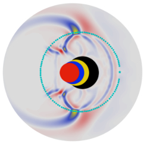

# gerjoii

[](./)

ground penetrating radar and electrical resistivity joint inversion (_gerjoii_)

by _diego domenzain_

https://diegozain.github.io/gerjoii

***

eager to start? __scroll down for an example__.

***

### Publications

* [Joint inversion of full-waveform GPR and ER data. Part 2: enhancing low frequencies with the envelope transform and cross-gradients](https://library.seg.org/doi/10.1190/geo2019-0755.1), __Diego Domenzain, John Bradford, and Jodi Mead__. _Geophysics, 85(6)_. 2020.

* [Joint inversion of full-waveform GPR and ER data. Part 1](https://library.seg.org/doi/10.1190/geo2019-0754.1), __Diego Domenzain, John Bradford, and Jodi Mead__. _Geophysics, 85(6)_. 2020.

* [Inversion of 2.5D electrical resistivity data using the discrete adjoint method](https://library.seg.org/doi/10.1190/segam2020-3417486.1), __Diego Domenzain, John Bradford, and Jodi Mead__. SEG Technical Program Expanded Abstracts 2020.

* [Joint inversion of full-waveform GPR and ER data enhanced by the envelope transform and cross-gradients](https://library.seg.org/doi/10.1190/gpr2020-087.1), __Diego Domenzain, John Bradford, and Jodi Mead__. 18th International Conference on Ground Penetrating Radar, Golden, Colorado 2020.

* [Joint inversion of GPR and ER data](https://library.seg.org/doi/10.1190/segam2018-2997794.1), __Diego Domenzain, John Bradford, and Jodi Mead__. SEG Technical Program Expanded Abstracts 2018.

***

__gerjoii__ does, for both radar and electrical resistivity: 

* forward models
* inversion routines (fwi for radar, adjoint method for both)
* inversions in parallel (inversion code parallelized)
* parallel inversions (many inversions at once, only with [Slurm](https://slurm.schedmd.com/))

### Forward modeling

* 2D and 2.5D
* linear & isotropic
* __radar__ (or acoustic)
	* finite difference time domain
	* PML boundaries
	* topography
	* arbitrary position of sources and receivers
* __electrical resistivity__
	* finite volume
	* Robin & Neumann boundaries
	* flat topography
	* surface sources & receivers

### Inversion routines

* 2D and 2.5D
* gradient descent
* __full-waveform inversion__ for radar
	* instantaneous phase
	* envelope
* adjoint method for electrical resistivity
* __complete access__ to all sensitivities and adjoint fields
* __joint inversions__
	* variable weights on sensitivities
	* cross-gradients
* support for field and synthetic data
* custom [Slurm](https://slurm.schedmd.com/) scripts ready to __dominate__ the cluster

### Signal processing

* waveform filtering
* image filtering
* velocity semblance
* beamforming
* radar source estimation
* __common-offset gather__ processing for radar

### Cuties

* 2D velocity generator (.png to .mat file, __any__ .png will do)
* electrical resistivity sequence generator ready for [Syscal](http://www.iris-instruments.com/syscal-pro.html)
	* dipole-dipole
	* Wenner
	* Schlumberger
	

* Matlab & Python data visualization

### Seismic interferometry

* cross-correlation
* multi-dimensional deconvolution

***

## docs

Detailed documentation of the code lives in the directory __docs/manuals/__.

***

# Examples

## Synthetic data

For a quick example go to __field/example-sy/__.

For a longer recipe read these steps:

1. In local, go to __field/shells___ and run `cloner.sh` to create a new synthetic toy example.
2. In the new folder __field/toy-sy/__ go to __image2mat/mat-file/__ to see the true parameters.
3. In __image2mat/initial-guess/__ see the initial parameters.
4. You can change both true and initial parameters as you wish. Read `build_model.pdf`.
5. Go to __toy-sy/base/scripts/__ and make sure `[wdc,w,dc]_begin_.m` loads the initial parameters you want.
6. Go to __toy-sy/inv-param/__ and edit whichever `P_inv_[dc,w, ].txt` you are going to use. This file controls the inversion parameters.
7. Upload __gerjoii__ to remote. You can use `rsync_gerjoii.sh`.
8. Go to __toy-sy/slurm/__ and read `slurm_howto.pdf` and `gerjoii2slurm.pdf`.
9. Run your code.
10. See results of files in remote while in local with utils in __field/server-see/__.
11. Download with with `download_[ ,obse,pinv,reco,u].sh`.
12. See in local with utils in `toy-sy/see/`.

## Field data

1. In __data/raw/__ make directory __project__ and inside that make these:
	```
	dc-data/syscal.txt
	dc-data/data-mat/
	dc-data/data-mat-raw/
	
	w-data/*[.HD, DT1]
	w-data/data-mat/
	w-data/data-mat-raw/
	w-data/data-mat-fwi/
	```

2. 
***

# Author

Diego Domenzain diegodomenzain@u.boisestate.edu

***