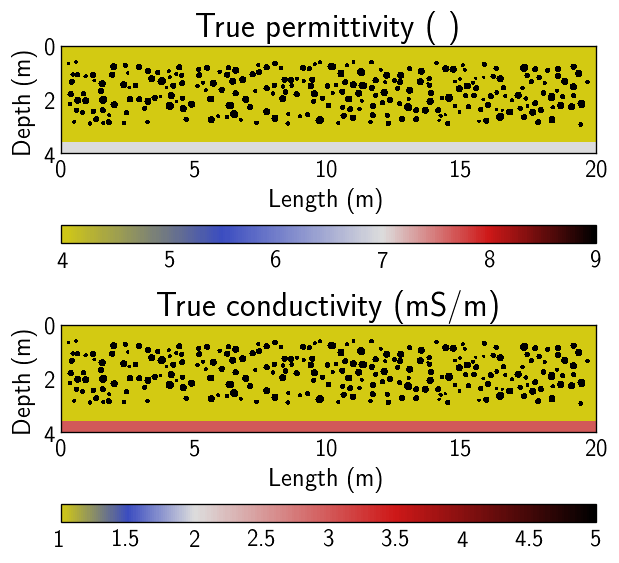

# ER example

This is an _out of the box_ type example for a 2D electrical resistivity inversion.

All the running code is in __example-sy/base/scripts/__. All the heavy lifting code is in __gerjoii/src__.

The folder __e1__ is a copy of base. This is the folder where you will re-write and run the scripts. You can also copy base into an __e2__, __e3__, etc.

## I just want to run the code, man

1. In the folder __gerjoii/field/example-sy/image2mat/nature-synth/initial-guess/__ place files _epsi_init.mat_ (initial relative permittivity model) and _sigm_init.mat_ (initial conductivity model (S/m)). Both of these files need to have variables named _epsi.mat_ and _sigm.mat_ of size 233 by 1161.

2. Because you are not running Slurm, please change line 195 of __dc_begin_.m__ to __gerjoii_.linker.yn = 'n';__

3. Go to __example-sy/e1/scripts/__ and run __dc_begin_.m__.

It's set to 10 iterations and 9 workers. Should take under 20min.

Once all the code is done running go to __e1/output/dc/__. You should see lots of nice files ready to plot. __This means it worked!__

## I want to know a little bit more

The first thing __dc_begin_.m__ does is load all the other folders needed to run the code.

Then it runs __param_wdc.m__.

The file __param_wdc.m__ directly sets the size of the domain in real numbers through the variables aa, bb and cc. There's a diagram there.

It also indirectly sets the size of the discretization. Because it is built to play with the radar inversion, the discretization is defined with the radar parameters.

Line 34 sets the values for relative permittivity (velocity). Leave this array with 6 entries, just change the numbers inside. Line 61 sets the value for the radar central frequency.

For a coarser grid: permittivity values (>=1) close to 1 and/or low positive frequencies.

For a finer grid: permittivity values large and/or high frequencies.

The next thing __dc_begin_.m__ does is load the true parameters for conductivity from a _.mat_ file. You can load them from wherever you want but the variable must be named _sigm.mat_.

If you're like _wait a second, how am I supposed to know the size of the conductivity matrix that I'm going to load now?_ 

Great question. That's why __begin_check.m__ exists. 

You run __begin_check.m__ first and tweak the parameters until you get what you want. This will run __param_wdc.m__ and __experim_check.m__.

The ER part is after line 136 in __experim_check.m__. The __experim_check.m__ file is just for checking. Whatever you actually want to change goes in __experim_wdc.m__. 

You can run the __begin_check.m__ script in your laptop - it only plots sources-receivers and spits out the discretization numbers to the console.

Back to __dc_begin_.m__.

Make sure the _.mat_ files you load have variable names _epsi_ and _sigm_. The conductivity should be in units of S/m.

I commented the noise on the data (lines 78-80). This means you'll run the inversions with noise free data.

The number of parallel workers matlab is going to call is in __example-sy/e1/tmp/workers.txt__. Right now is 9.

The next important thing you need to focus on is the file __example-sy/inv-param/P_inv_dc.txt__. 

Each line of this file sets the inversion parameters for one inversion. Line 1 acts on folder e1, and etc.

The parameters for this inversion are not calibrated at all.

Now let's see line 116 of __dc_begin_.m__. 

Here you load from wherever you want the initial models. Again, make sure the file you load has a variable name of _sigm_. You can also force it to be homogeneous uncommenting line 125 and commenting line 124.

Because you're not running Slurm, please change line 195 of __dc_begin_.m__ to __gerjoii_.linker.yn = 'n';__
You'll want to change this both in __base__ and in __e1__.

Once all the code is done running go to __e1/output/dc/__. You should see lots of nice files ready to plot. __This means it worked!__

You can also go to __example-sy/see/__ and in a terminal run ```python viewer_dc.py```. 

The name of the project will be __e1__ for this case. You can adjust where the white is displayed with the variable _midi_s_ in __viewer_dc.py__.

Also in __see__ you can run ```python true.py``` to plot both the true and initial models.

The observed data will be saved in __e1/data-synth/dc/__. To see the pseudo-sections you need to use __example-sy/see/data_dc.m__.

If you're like _whoa wait a second, I want to know what this s_i_r_d_std.mat cell nonsense is_, you can go to __example-sy/base/scripts/experim_wdc.m__ line 173.

I'll leave it at that. There's more things you can do but this should cover the basics. 

## Pictures from __see__

[](./)
[](./)
[](./)