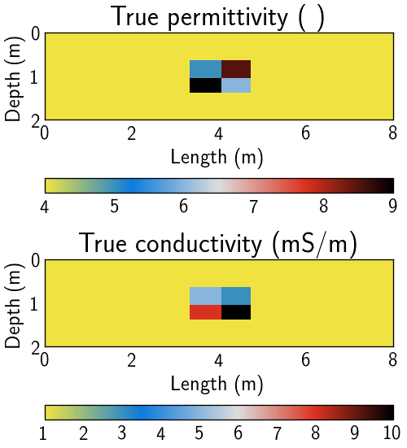
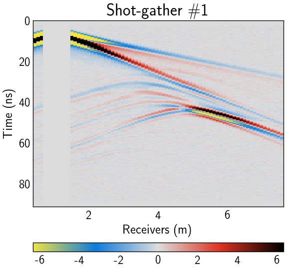
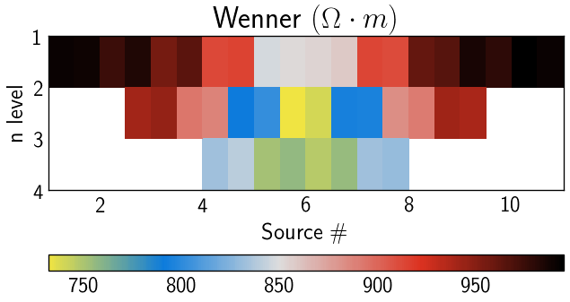

# Tiny radar & DC 2D example
diego domenzain

March 2021 @ Colorado School of Mines

**run forward models of radar & DC two-dimensional data on a tiny model**

[](./)

```
wave cube will be of size (double precision)          1      [Gb]
electric potential will be of size (double precision) 4.3e-4 [Gb]

x [m] = 8.0 
z [m] = 2.0 
t [ns] = 91.475508 

fo [Hz] = 2.5e+08 

dx [m] = 0.017237 
dz [m] = 0.017237 
dt [ns] = 0.036590 

n (no PML) = 465 
m (no PML, no air) = 117 
air = 60 
nt = 2500 
```

If you want to run the inversions on your personal computer, this is the right example for you.

The model parameters have no geological meaning, but are consistent with possible physical subsurface parameters.

The entire example is customizable too.

### Steps

1. Run the file,
   * ```gerjoii/field/tinyradar-sy/base/scripts/begin_check.m```
   * this will generate ```x.mat``` and ```z.mat``` needed for the step below.
   
1. The model parameters will have the shape of the image shown in,
   * ```gerjoii/field/tinyradar-sy/image2mat/nature-synth/images/tiny.png```
   * Feel free to edit this picture as you wish.
   * To make your life simple, try using the same colors as the original ```tiny.png```.
   * When you are done, make two copies: ```epsi.png``` and ```sigm.png```.
   
1. Choose your model parameter values in:
   * ```gerjoii/field/tinyradar-sy/image2mat/image2gerjoii.m```
   ```
   % permittivity
   eps_rgb = [23; 37; 130; 132; 255];
   eps_rel = [9; 8.5;   6;   5;   4];
   % conductivity
   sig_rgb = [0; 39; 133; 135; 255];
   sig_ele = [10; 8;   5;   3;   1]*1e-3;
   ```
   * Values for relative permittivity must be between 2 and 9.
   * Values for conductivity must be larger than zero.
   * This will save the model parameters as ```.mat``` files.
   * You can also save initial homogeneous models running this script.
   
1. Now you should copy-paste the directory ```base/``` and rename it ```t1/``` like so:
   * ```gerjoii/field/tinyradar-sy/t1/```
   
1. Go into ```t1/scripts/``` of this new directory and run *```w_fwd_u.m```*.
   * **This will generate the synthetic observed data,**
   
1. Memory requirements,
   * 0.7Gb of memory per CPU at most during the *radar forward model*
   * These 0.7Gb are due to the radar **wavefield storage**
   
1. For the model presented here running on
   * a *HP Elitebook* with *2 CPUs* and *Matlab 2021a*,
     * 65 seconds for 10 sources.
   * the *University cluster* with *10 nodes* and *Matlab 2020a*,
     * ?

### Visualize the results

1. The synthetic *observed* data is in,
   * ```t1/data-recovered/```
   
1. The interface to visualize all the data is in,
   * ```tinyrdar-sy/see/```
   
1. These scripts visualize the data,
   * ```data_dc.m```
   * ```data_w.m``` and ```data_w.py```
   
### radargrams

* Each GPR shot-gather is saved as a structure called ```line#.mat```.
* When loading each ```line#.mat``` you get a ```radargram``` structure,
	```matlab
	       d: [time × receivers, single]
         t: [time × 1, double]
        dt: 3.6590e-11                     seconds
        fo: 250000000                      Hertz
        dx: 0.0172                         meters
         r: [receivers × (x,z), double]    meters
         s: [x y]                          meters
        dr: receiver spacing               meters
       dsr: source-receiver spacing        meters
    wvlet_: [time × 1, double]              V/m
        Jy: [current-source × 1, single]    V
      std_: [time ⋅ receivers × 1, double]
	```
---

### True model

[](./)[](./)[](./)