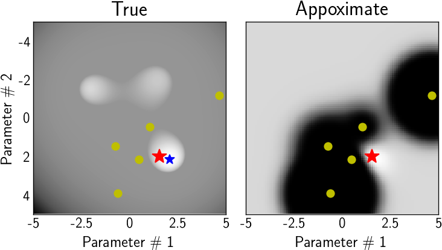

# Finding hyper-parameters

How do we find the right hyper-parameters for an inversion? 

Assume we are in ```ml/code/```.

## Bayesian Optimization

[](./)

1. ```../../../../shells_/download_pinv.py``` Downloads all hyper-parameters and their respective objective values from each inversion run. Puts them in ```../../all/```

1. ```viewer_runs.py``` Visualize,
    
  * objective function values for all runs ```../pics/inversion_runs.png```
  * hyper-parameters for all inversions ```../pics/parames.png```

1. ```inv_param_.py``` Sets up the bayesian optimization on the hyper-parameters.
    
  * Select inversion runs to use for finding hyper-parameters.
  * Computes the _target objective function path_ based on previous runs.
  * Computes _inception objective function_. There are two options for this,
    * the last value of each inversion run,
    * a measure of how far an inversion run is from the target objective function path.
    * NaN values (dead inversion runs) are given arbitrary high real values.
    * Result is displayed in ```inversion_inception.png```
  * Saves in ```../data/```:
    * all objective function runs,
    * hyper-parameters,
    * target objective function,
    * inception objective function.

1. ```go_baye.py``` Runs the bayesian optimization on the hyper-parameters: given hyper-parameters with associated value in inception objective function, find the hyper-parameters that minimize the inception objective function.

  * Loads hyper-parameters and inception objective function.
  * Sets bounds for each hyper-parameter.
  * Does bayesian magic from ```bayesian_opti.py```.
  * Saves hyper-parameters in ```../data/p_new_.txt``` ready to put in ```../../P_inv.txt``` for inversion.
  
## Using a neural network

1. What code does this??

---