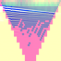

### Recovery of 1D electrical parameters using machine learning

The overall idea is described bellow.

1. Generate many 2 layer models labeled by index,

  * the space of 2L models is parametrized by a cube matrix of size,
  
    cube-size = (me ms) (me-1) (ms-1) ml 
   
    where me, ms and ml are the number of elements in the permittivity, conductivity, and depth discretizations.  

1. Run forward models on all 2L models. 

1. Take the data from all forwardd models and transform to RGBA pictures,

  * R channel is the pseudo-section of dipole-dipole with spacing a = 1
  
  * G channel is the pseudo-section of the Wenner data
  
  * B channel is the (one-sided) radar shot-gather
  
  * A channel is empty (for this version of the algorithm)
  
1. Each RGB picture from above is the data, the labels are the indices of the 2L model.

1. Train on a CNN machine.

1. Generate random _combinations_ of 2L models.

1. Forward model these random 2L _combination_ models, and convert data to RGBA pictures.

1. Test the CNN machine on the RGBA picture data for these 2L _combination_ models.

  * The output of the CNN machine is a set of probabilities for each 2L model.
  
  * Take the indices of these probabilities and build a _combination_ of them.
  
  * The output should be the input model.

If the last step works, then convert field data to an RGBA picture and run it through the trained CNN machine.

Take the output of the CNN machine and _combine_ it. The output should be a 1D layered permittivity and conductivity model.