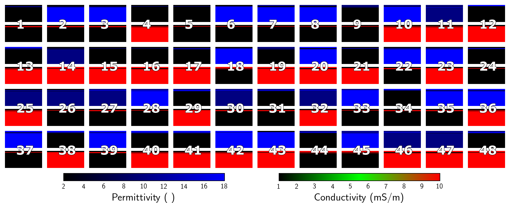

# Data and pictures

You should be in ```models-ml/scripts/```.

1. Run all desired forward models, ```[w,dc,wdc]_fwd_2l.m```. If you want testing data run ```wdc_fwd_test.m```.

1. Get all data in local, ```../../../download_ml.sh```

1. If ```dc``` in previous step then ```dc2voltagrams.m```

1. Make pics with ```dc2pics.py``` and/or ```w2pics.py```

  * if both in previous step then ```im2rgb.py```

1. ```just_pics.sh``` puts all pictures in one big folder so baby tensorflow can read it 

1. ```ml_2l.py``` for training the learning machine

1. Render the different subsurface models 

  * ```models2mat.m``` builds ```mat``` files for training
  * ```models2mat_.m``` builds ```mat``` files for testing
  * ```models2pics.py``` builds pictures from ```mat``` files
  * ```model-pics.sh``` moves pictures to a directory of their own in ```../data-set/```
  * ```see_models.py``` makes pictures with no legends for thumbnails
  
1. Make tiny thumbnails for the data and the models, ```thumb_grid.py```.

The shell script ```data2ml.sh``` automates steps 3-5 and 7-8.

## Training example 

Models


Data


## Testing example 

Testing Models


Estimated Models
