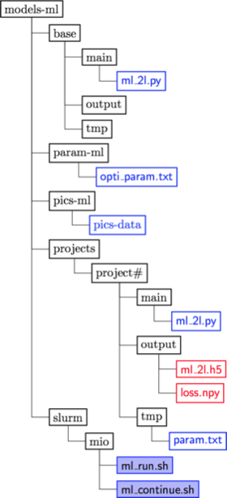

# For Slurm




1. Check the parameters you want in ```opti_param.txt```.

1. Upload to server with ```gerjoii/field/ml_push.sh```.

1. Run shell file ```ml_run.sh```,

  1. choose project number,
  1. copy ```base``` into ```project/project#/```,
  1. run Slurm batch file that will put job in the queue (```ml_run.bash```).
  
1. The file ```ml_run.bash``` will queue ```ml_2l.py```,

  1. read optimization parameters from ```opti_param.txt``` and copy them in ```param.txt```,
  1. run optimization with data from ```pics-data```,
  1. save the learning machine (```ml_2l.h5```) and the loss history of the optimization (```loss.npy```) to disk.

1. Download ```project#/output``` with ```gerjoii/field/ml_pull.sh```.